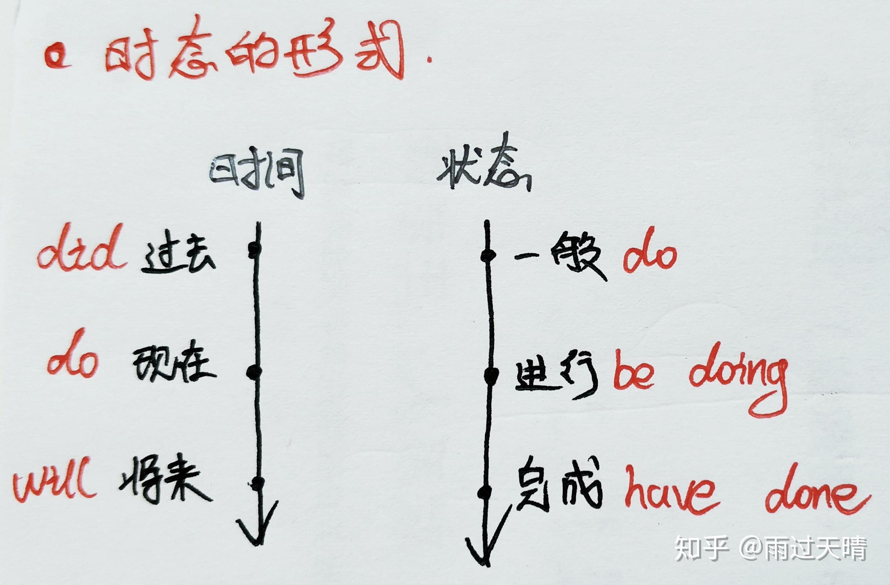
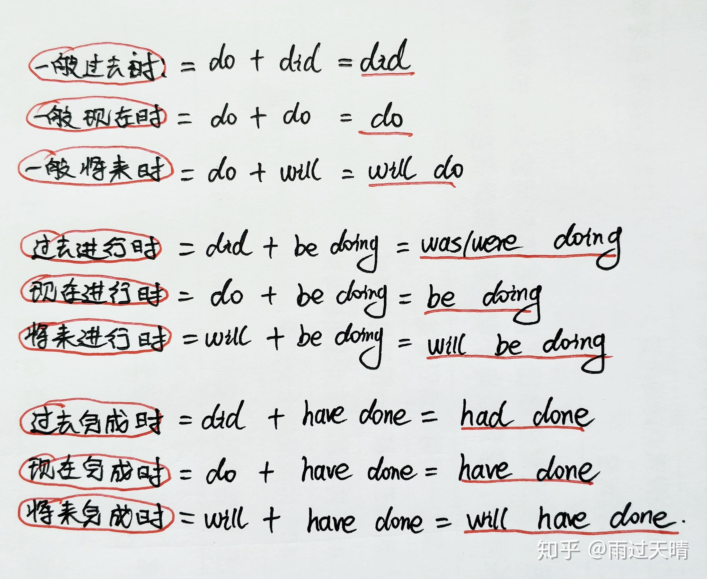
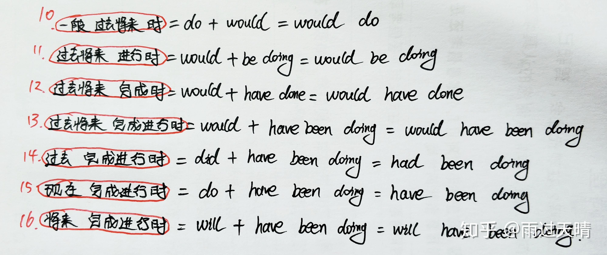
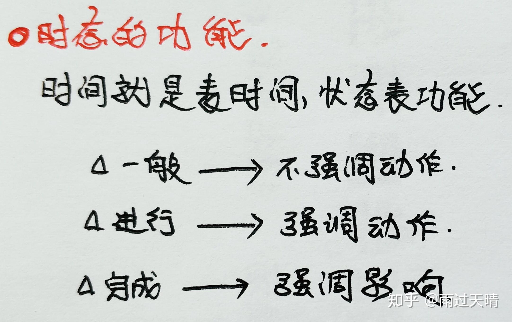

# 时态

[摘自知乎作者](https://zhuanlan.zhihu.com/p/88680858?utm_psn=1854581711926595584)

## 时态=时间+状态

## 时态有16种

- 前9种
  
  

- 后7种
  
  
  
  

## 时态的功能

## 例句
**I often watch TV.**  我经常看电视  一般现在时：发生在现在，不强调动作 do+do=do（watch看，用动词原形） **I watched TV just now.**
我刚刚在看电视 一般过去时：发生在过去，不强调动作 do+did=did（watched看，过去式）  **I am watching TV.**  我正在看电视 现在进行时：发生在现在，正在进行的动作 do+be doing=be doing（am watching正在看）  **I was watching TV when you came in.**  过去进行时：发生在过去，正在进行的动作 did+be doing=was/were doing（was watching）  **Yestday he told me he would go to the zoo next Sunday.**  他昨天告诉我他下周天会去动物园.  一般过去将来时：主体动作发生在过去，客体动作是将来可能要发生的动作 do+would=would do（主体动作told，did形式）  **I have finished my homework.**  我完成了我的作业.  现在完成时：截止到现在已经完成了的动作对现在造成的影响. do+have done= have done（have finished）  **He had lived here for 20 years by the end of last year.**  截止到去年末，他已经在这里居住了20年了  过去完成时：过去的过去发生的动作对过去赵成的影响 did+have done=had done  **The students have been being taught by me for 10 years.**  我教这些学生已经十年了。  现在完成进行时：（既强调动作又强调影响）截止到现在已经完成且未来还会进行的动作 do+have been doing=have been doing  **I had been teaching here before you came to the city.**  在你来这个城市之前我就在这教学了  过去完成进行时：did+have been doing=had been doing  **We will be having a meeting at this time next Sunday.**  下周天的这个时候我们将正在开会  将来进行时：发生在将来，正在进行的动作 will+be doing=will be doing  **He said we would be having a meeting at this time next Sunday.** 他说下星期天这个时候我们要开会。  过去将来进行时：would+be doing=would be doing  **I will have finished the book by the end of this year.**  我将在今年年底前完成这本书。  将来完成时：将来以前发生的动作对将来造成的影响 will+have done=will have done  **He told us that he would have finished the book by the end of this year.**  他告诉我们他将在今年年底完成这本书。  过去将来完成时：would have done  **By next summer，he will have been teaching here for 30 years.**  到明年夏天，他将在这里教书30年。  将来完成进行时：will+have been doing=will have been doing  **He told us he would been teaching here for 30 years by next summer.**  他告诉我们到明年夏天他将在这里教书30年。  过去将来完成进行时：would+have been doing=would have been doing